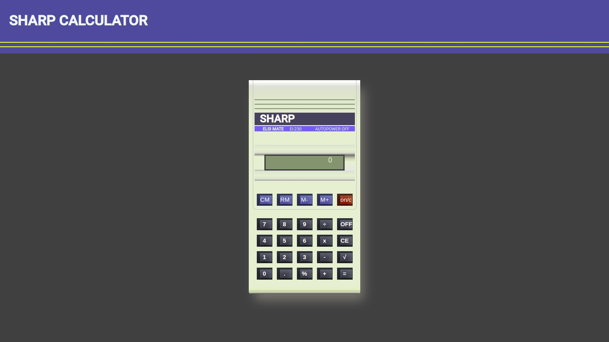

# Calculator - Javascript
-Autor: Eudes Lima
-Email: developer@eudeslima.com
-Site: Eudeslima.com

With this project, I made a calculator built without images, I used only pure CSS and gave life to the project with javascript.

## Introduction

In this project, the following characteristics were used:

### Calculator Sharp Elsi Mate El - 230

This is a calculator from 1982, Arithmetic calculator from the Japanese company Sharp, with 8-digit precision, with algebraic logic and 6 functions. It has a small 8-digit LCD screen and a 25-key keyboard in three colors: black for numbers and functions (addition, subtraction, multiplication, division, square root and percentage calculation), blue for memory and the red one for power on and deletion (power off is automatic).

## Considerations

"This is a small tribute I pay to my dear father, Eudes Lima("1949-2021").